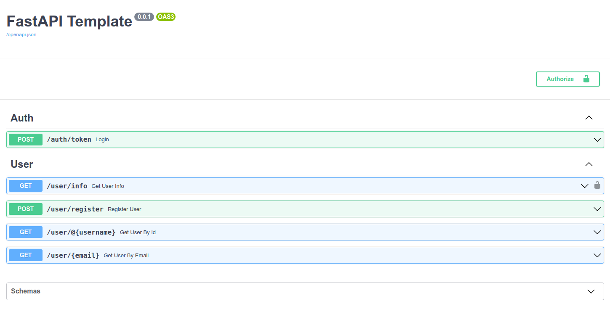
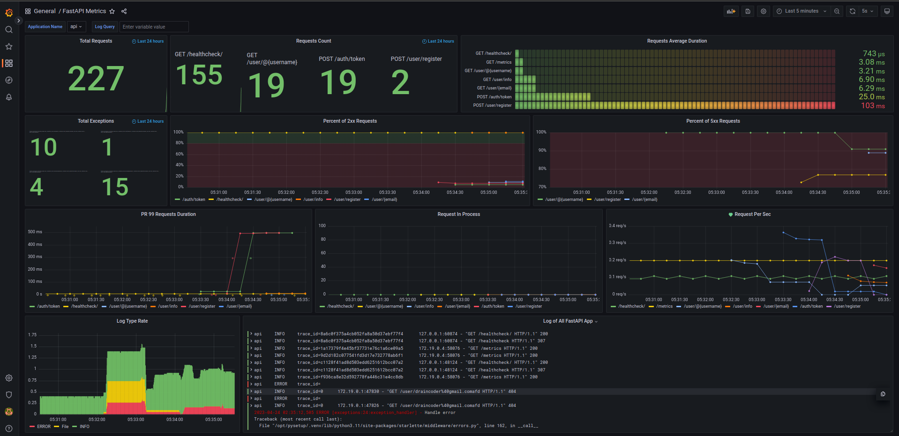

# FastAPI Auth Template

A small FastAPI template with OAuth authorization without using third-party authorization libraries and with simple CRUD operations

### Quick start
+ `make migrate_docker`
+ `make up`

### Python libs stack
+ [FastAPI](https://fastapi.tiangolo.com/) — Async web framework for REST
+ [SQLAlchemy 2.0](https://docs.sqlalchemy.org/en/20/) — ORM for working with database
+ [Alembic](https://alembic.sqlalchemy.org/en/latest/) — Database schema migration tool
+ [Pydantic](https://docs.pydantic.dev/) — Data validation and settings management

### Infrastructure
+ [Postgres](https://www.postgresql.org/docs/current/index.html) — Database
+ [Docker](https://docs.docker.com/) — For deployment

### Monitoring stack
+ [Grafana](https://grafana.com/docs/grafana/latest/) — Web view for logs
+ [Loki](https://grafana.com/docs/loki/latest/) — A platform to store and query logs
+ [Tempo](https://grafana.com/docs/tempo/latest/) — A high-volume distributed tracing backend
+ [Vector.dev*](https://vector.dev) — A tool to collect logs and send them to Loki
+ [Prometheus](https://prometheus.io/) - Monitoring system and time series database\
`* - in development`

### Check list
- [x] Create template
- [x] Configure Docker
- [x] Configure monitoring
- [ ] Add auto-tests

### Open source projects that have had an impact
+ [Shvatka](https://github.com/bomzheg/Shvatka)
+ [User Service](https://github.com/SamWarden/user_service)